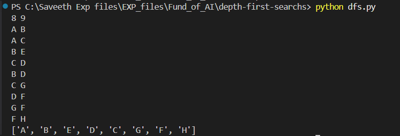
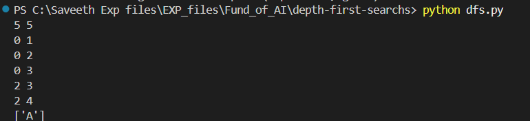

# ExpNo 2 : Implement Depth First Search Traversal of a Graph  

### Name: Abishek Priyan M
### Register Number: 212224240004

### Aim:  
To Implement Depth First Search Traversal of a Graph using Python 3.  

### Theory:  

**Depth First Traversal (DFS)** for a graph is like Depth First Traversal of a tree. The only catch here is that, unlike trees, graphs may contain cycles (a node may be visited twice). Use a Boolean visited array to avoid processing a node more than once. A graph can have more than one DFS traversal.  

Depth-first search is an algorithm for traversing or searching trees or graph data structures. The algorithm starts at the root node (selecting some arbitrary node as the root node in the case of a graph) and explores as far as possible along each branch before backtracking.  

- **Step 1:** Initially, stack and visited arrays are empty.  

    

- **Step 2:** Visit `0` and put its adjacent nodes which are not visited yet into the stack.  

    

  Visit node 0 and put its adjacent nodes (1, 2, 3) into the stack.  

- **Step 3:** Now, Node 1 is at the top of the stack, so visit node 1 and pop it from the stack and put all of its adjacent nodes which are not visited in the stack.  

    

  Visit node 1.  

- **Step 4:** Now, Node 2 is at the top of the stack, so visit node 2 and pop it from the stack and put all of its adjacent nodes which are not visited (i.e., 3, 4) in the stack.  

    

  Visit node 2 and put its unvisited adjacent nodes (3, 4) into the stack.  

- **Step 5:** Now, Node 4 is at the top of the stack, so visit node 4 and pop it from the stack and put all of its adjacent nodes which are not visited in the stack.  

    

  Visit node 4.  

- **Step 6:** Now, Node 3 is at the top of the stack, so visit node 3 and pop it from the stack and put all of its adjacent nodes which are not visited in the stack.  

    

  Visit node 3.  

Now, the stack becomes empty, which means we have visited all the nodes, and our DFS traversal ends.  

---

### Algorithm:  
1. Construct a Graph with Nodes and Edges  
2. Depth First Search Uses Stack and Recursion  
3. Insert a START node to the STACK  
4. Find its Successors or Neighbors and Check whether the node is visited or not  
5. If Not Visited, add it to the STACK. Else Call The Function Again Until No more nodes need to be visited.  

---

### Sample Input 1  
8 9

A B 

A C

B E

C D

B D

C G

D F

G F

F H

### Output 1

### Sample input 2:
5 5

0 1

0 2

0 3

2 3

2 4

### Output 2:

---

### Result:  
Thus, a graph was constructed and implementation of Depth First Search for the same graph was done successfully.
